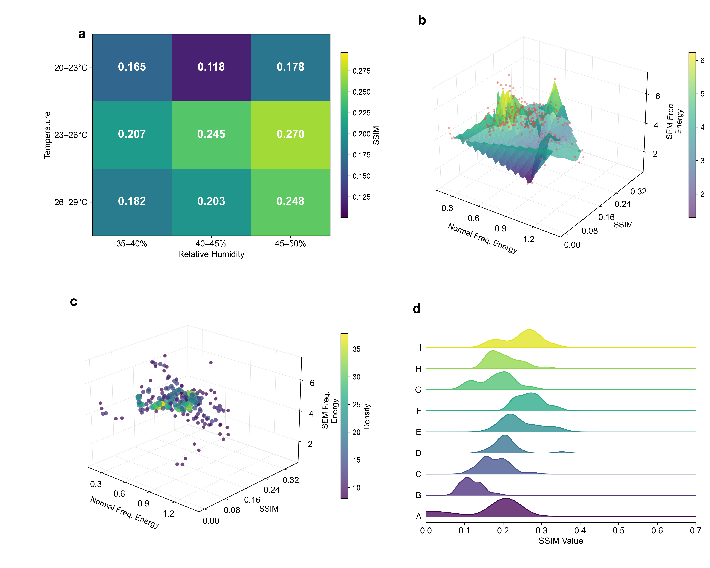

# A Physically-Grounded Multi-modal Imaging Dataset of Colloidal Coffee Ring Deposits

[](https://doi.org/10.5281/zenodo.18918624)


---

## Overview

This repository contains the analysis code for a **physically-grounded multi-modal imaging dataset** of colloidal coffee ring deposits from environmental water samples.

Unlike semantically paired multi-modal datasets, the three modalities in this dataset image the **same physical deposit** through fundamentally different measurement principles — grounding cross-modal correspondence in shared physical structure rather than human annotation.

<p align="center">
  
  <br>
  <em>Representative data from condition B: Mobile phone images (top), SEM images (middle), and EDS elemental maps — Cl channel (bottom) for five water sample compositions.</em>
</p>

---

## Dataset Highlights

| Property | Details |
|---|---|
| **Modalities** | Mobile phone imaging · Scanning Electron Microscopy (SEM) · Energy-Dispersive X-ray Spectroscopy (EDS) |
| **Total images** | 2,475 (225 phone + 225 SEM + 1,575 EDS + 450 corrected) |
| **Sample sets** | 225 (5 water compositions × 5 replicates × 9 conditions) |
| **Environmental conditions** | 3×3 factorial: temperature (20–29°C) × humidity (35–50%) |
| **Water compositions** | 5 synthetic samples based on Michigan water quality data |
| **Computed features** | 91 per image pair (GLCM texture, frequency domain, morphological, SSIM) |
| **Dataset access** | [Zenodo — DOI: 10.5281/zenodo.18918624](https://doi.org/10.5281/zenodo.18918624) |

### Environmental Conditions (A–I)

| Condition | Temperature (°C) | Humidity (%) |
|:---------:|:----------------:|:------------:|
| A | 20–23 | 35–40 |
| B | 20–23 | 40–45 |
| C | 20–23 | 45–50 |
| D | 23–26 | 35–40 |
| E | 23–26 | 40–45 |
| F | 23–26 | 45–50 |
| G | 26–29 | 35–40 |
| H | 26–29 | 40–45 |
| I | 26–29 | 45–50 |

---

## Cross-modal Validation

<p align="center">
  
  <br>
  <em>Cross-modal validation: (a) SSIM heatmap across environmental conditions, (b) feature interaction surface, (c) 3D feature density distribution, (d) per-condition SSIM distributions.</em>
</p>

Cross-modal correspondence is empirically verifiable: morphological features show r = 0.659 correlation between mobile phone and SEM images, demonstrating that the modalities capture physically linked information from the same deposit.

---

## Repository Structure

```
chapter_3_data/
├── experiment/                     # Analysis scripts
│   ├── complete_cv_analysis.py     # Main CV feature extraction pipeline
│   ├── dataset_statistical_analysis.py  # Statistical analysis
│   ├── generate_figure3.py         # Figure 3 (SSIM & feature distributions)
│   ├── generate_heatmaps.py        # Heatmap visualizations
│   ├── advanced_visualizations.py  # Additional figures
│   ├── generate_data_overview.py   # Script to generate multi-modal data overview figure
│   ├── comprehensive_computer_vision_features.csv  # Computed features
│   ├── run_analysis.sh             # Shell script to run full pipeline
│   ├── README.md                   # Experiment-level documentation
│   └── WORKFLOW_GUIDE.md           # Step-by-step workflow guide
├── assets/                         # Images for this README
└── README.md                       # This file
```

> **Dataset files** (595 MB) are hosted on Zenodo, not in this repository.
> Download from: https://doi.org/10.5281/zenodo.18918624

---

## Dataset Structure (on Zenodo)

```
data/
├── optical/A–I/        # Mobile phone images (JPEG, 1280×1024, 225 total)
├── sem/A–I/            # SEM images (JPEG, 2560×1920, 225 total)
│                       # + SEM instrument metadata (TXT, 225 total)
├── eds/A–I/            # EDS elemental maps (PNG, 630×472, 7 elements/sample, 1575 total)
├── corrected_images/A–I/  # Preprocessed phone + SEM images (450 total)
├── features/           # Computer vision features (CSV, 91 features/pair)
└── metadata/           # Environmental conditions, sample compositions, image stats
```

---

## Requirements

```bash
pip install numpy pandas opencv-python scikit-image scipy matplotlib
```

| Package | Version | Purpose |
|---|---|---|
| `numpy` | ≥1.21 | Array operations |
| `pandas` | ≥1.3 | Data handling |
| `opencv-python` | ≥4.5 | Image processing |
| `scikit-image` | ≥0.18 | SSIM, GLCM features |
| `scipy` | ≥1.7 | Statistical analysis |
| `matplotlib` | ≥3.4 | Visualization |

---

## Usage

### 1. Run the full analysis pipeline

```bash
cd experiment/
bash run_analysis.sh
```

### 2. Extract computer vision features

```python
python complete_cv_analysis.py
# Output: comprehensive_computer_vision_features.csv
```

### 3. Statistical analysis

```python
python dataset_statistical_analysis.py
# Output: statistical reports and heatmap figures
```

### 4. Generate Figure 3 (SSIM & feature distributions)

```python
python generate_figure3.py
# Requires: comprehensive_computer_vision_features.csv
# Output: analysis2.pdf / analysis2.png
```

### 5. Load the dataset in Python

```python
import cv2
import numpy as np
from pathlib import Path

data_root = Path("path/to/data")

# Load a mobile phone image (condition B, sample 3)
phone_img = cv2.imread(str(data_root / "optical" / "B" / "Image_3.jpg"))

# Load the corresponding SEM image
sem_img = cv2.imread(str(data_root / "sem" / "B" / "SEM_3.jpg"), cv2.IMREAD_GRAYSCALE)

# Load EDS elemental map (Cl channel)
eds_cl = cv2.imread(str(data_root / "eds" / "B" / "3" / "Cl Kα1.png"), cv2.IMREAD_UNCHANGED)

# Load computed features
import pandas as pd
features = pd.read_csv(str(data_root / "features" / "comprehensive_computer_vision_features.csv"))
```

---

## Citation

If you use this dataset or code, please cite:

```bibtex
@article{li2026coffeering,
  title   = {A Physically-Grounded Multi-modal Imaging Dataset of Colloidal Coffee Ring Deposits},
  author  = {Li, Xiaoyan and Jiang, Cuicui and Yang, Rumei and Lahr, Rebecca H.},
  journal = {Scientific Data},
  year    = {2026},
  doi     = {10.5281/zenodo.18918624}
}
```

---

## Authors

| Name | Affiliation | Role |
|---|---|---|
| **Xiaoyan Li** | Tsinghua University | First author, data collection, analysis |
| **Cuicui Jiang** | Inner Mongolia University, College of Computer Science | Data analysis |
| **Rumei Yang** | Nanjing Medical University, School of Nursing | Data interpretation |
| **Rebecca H. Lahr** | Ann Arbor City | Corresponding author, project conception |

📧 Corresponding authors: [xiaoyanli629@tsinghua.edu.cn](mailto:xiaoyanli629@tsinghua.edu.cn) · [rlahr@a2gov.org](mailto:rlahr@a2gov.org)

---

## Acknowledgments

We acknowledge the use of the JEOL 6610LV SEM system for high-resolution imaging and thank the Michigan water quality monitoring program for providing foundational data for the synthetic water sample preparations.

---

## License

The code in this repository is licensed under the [MIT License](https://opensource.org/licenses/MIT). The dataset hosted on Zenodo is licensed under [CC BY 4.0](https://creativecommons.org/licenses/by/4.0/).
